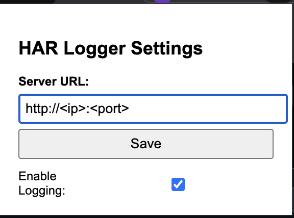

## Traffic Logger 

* Open extension tab > Enable developer mode > Load unpacked > Select the trafficlogger folder to Load the extension

* Run server.py in vps ( change port acc to your need )
* Set your server ip and port > Save
* Browse your bugbounty targets & Observe all traffic in your terminal
* All traffic will be saved to urls.log in the same directory of the server.py, you can change the log file name in the script

Happy hacking :)
